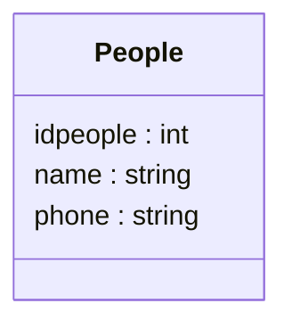

# Annuaire - documentation du service web

URL : https://iutdijon.u-bourgogne.fr/intra/iq/webservices/annuaire/api.php

Service web très simple permettant de gérer un annuaire partagé. Utilisable à des fins pédagogiques.

## Schémas utilisés

Une seule entité : une personne, comprenant deux propriétés (name, phone) de type chaîne de caractères, ainsi qu'une propriété idpeople qui est un entier et qui sert d'identifiant.



## Points d'entrées - API

### [GET] Obtenir la liste des personnes

Entrées : aucune

Format de retour : tableau JSON

Exemple : 

```json
[{"idpeople":"454","name":"Florence","phone":"0123456789"},{"idpeople":"456","name":"Maxime","phone":"0609079866"}]
```

### [POST] Ajouter une personne

Ajoute une personne à l'annuaire partagé.

Format d'entrée : la personne en JSON, dans le corps de la requête, sans l'identifiant qui est automatiquement ajouté

Exemple : 

```json
{"name":"toto","phone":"123456"}
```

Retour : en json, la personne complète (avec son identifiant autogénéré) en cas de succès.

Exemple :

```json
{"name":"toto","phone":"123456", "idpeople":"423"}
```

### [DELETE] supprimer une personne

Supprime une personne de l'annuaire partagé.

Format d'entrée : en paramètre de requête (id), l'identifiant de la personne à supprimer.

Sortie : texte brut, "person deleted" en cas de succès


